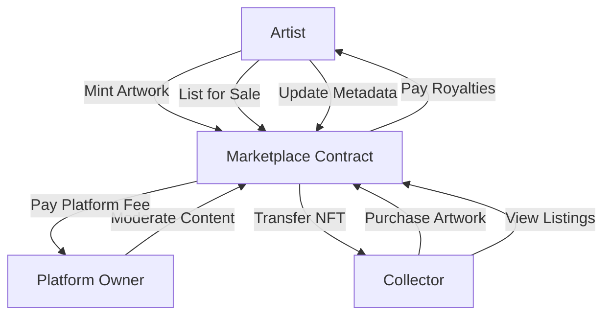

# ArtNest Discovery Platform

A decentralized NFT marketplace built on Stacks blockchain enabling independent artists to showcase and sell digital artwork directly to collectors.

## Overview

ArtNest is a decentralized platform that empowers digital artists by providing a direct connection to collectors through blockchain technology. The platform leverages NFTs to represent digital artwork ownership while ensuring artists receive fair compensation through an automated royalty system.

### Key Features

- NFT minting for digital artwork
- Primary and secondary market sales
- Automated royalty distribution
- Transparent provenance tracking
- Moderation system for content quality
- Customizable artist profiles
- Direct STX payments

## Architecture

The platform is built around a central marketplace smart contract that handles all core functionality:



### Core Components

1. **Token Management**
   - NFT minting and ownership tracking
   - Metadata storage and updates
   - Transfer mechanisms

2. **Marketplace Operations**
   - Listing management
   - Purchase processing
   - Fee calculations

3. **Royalty System**
   - Automated distribution
   - Configurable rates
   - Secondary market tracking

4. **Platform Security**
   - Moderation controls
   - Access restrictions
   - Price validations

## Contract Documentation

### artnest-marketplace.clar

The main contract managing the entire marketplace functionality.

#### Key Functions

**Minting & Management:**
- `mint-artwork`: Create new NFT artwork
- `update-artwork-metadata`: Modify artwork details
- `update-royalty`: Adjust royalty percentage

**Market Operations:**
- `list-artwork`: Create sale listing
- `purchase-artwork`: Buy listed artwork
- `cancel-listing`: Remove from sale
- `transfer-artwork`: Direct transfer to another user

**Platform Administration:**
- `add-moderator`: Grant moderation privileges
- `remove-moderator`: Revoke moderation access
- `moderate-artwork`: Control content visibility

## Getting Started

### Prerequisites

- Clarinet
- Stacks wallet
- STX tokens for transactions

### Basic Usage

1. **Minting Artwork**
```clarity
(contract-call? .artnest-marketplace mint-artwork 
    "Artwork Title" 
    "Description" 
    "ipfs://artwork-hash" 
    u10)
```

2. **Listing for Sale**
```clarity
(contract-call? .artnest-marketplace list-artwork 
    u1 
    u1000000)
```

3. **Purchasing Artwork**
```clarity
(contract-call? .artnest-marketplace purchase-artwork 
    u1)
```

## Function Reference

### Artist Functions

```clarity
(mint-artwork (title (string-ascii 100)) 
             (description (string-utf8 500))
             (ipfs-url (string-ascii 100))
             (royalty-percent uint))

(update-artwork-metadata (token-id uint)
                        (new-title (string-ascii 100))
                        (new-description (string-utf8 500)))

(update-royalty (token-id uint) 
                (new-royalty-percent uint))
```

### Collector Functions

```clarity
(purchase-artwork (token-id uint))

(transfer-artwork (token-id uint) 
                 (recipient principal))
```

### Market Functions

```clarity
(list-artwork (token-id uint) 
             (price uint))

(cancel-listing (token-id uint))
```

## Development

### Testing

1. Install Clarinet
2. Clone the repository
3. Run tests:
```bash
clarinet test
```

### Local Development

1. Start Clarinet console:
```bash
clarinet console
```

2. Deploy contracts:
```clarity
(contract-call? .artnest-marketplace init)
```

## Security Considerations

### Platform Safeguards

- Moderation system for content control
- Price minimums to prevent abuse
- Maximum royalty caps
- Owner-only administrative functions

### Transaction Safety

- Self-transfer prevention
- Ownership verification
- Active listing checks
- Moderation status validation

### Limitations

- Fixed platform fee structure
- Royalties can only be decreased
- No fractional ownership
- Single currency (STX) support